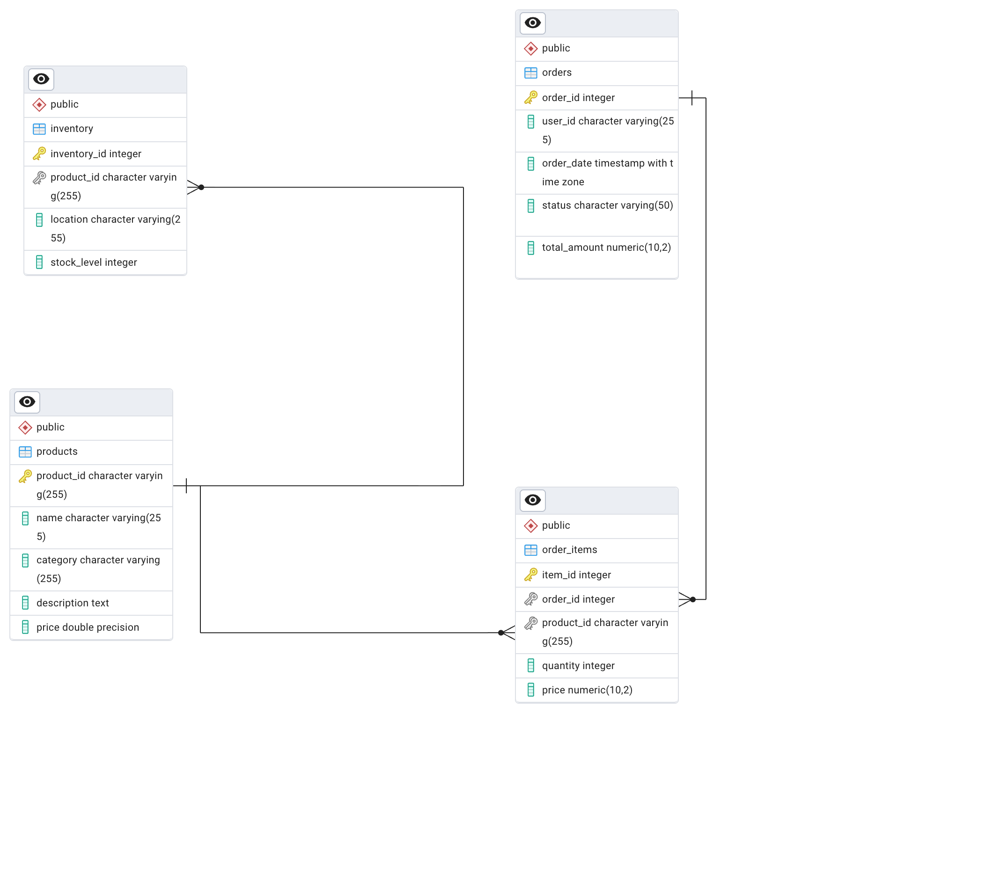

# Order Management API

This is a Flask-based API for managing customer orders. It provides an endpoint to place new orders, interacting with a PostgreSQL database on Cloud SQL to manage order and inventory data.

## Database Schema:
The is the complete Database schema, you can run the [Retail Database](retail_db.sql) for tables and schema creation.


## Endpoints

### Place Order

*   **URL:** `/place_order`
*   **Method:** `POST`
*   **Description:** Creates a new order in the system. It validates inventory, calculates prices, and updates the database within a single transaction.
*   **Payload:**

    ```json
    {
      "customer_id": "some_customer_id",
      "items": [
        {
          "product_id": "SKU123",
          "quantity": 1
        },
        {
          "product_id": "SKU456",
          "quantity": 2
        }
      ]
    }
    ```

*   **Success Response:**

    *   **Code:** `201 CREATED`
    *   **Content:**
        ```json
        {
          "message": "Order placed successfully",
          "order_id": 12345
        }
        ```

*   **Error Responses:**
    *   `400 Bad Request`: Invalid JSON, missing fields, or invalid item format.
    *   `500 Internal Server Error`: Database connection issues or other unexpected errors.

## Requirements

The application requires the following Python packages:

*   Flask
*   gunicorn
*   cloud-sql-python-connector[pg8000]
*   SQLAlchemy

These can be installed from `requirements.txt`:

```bash
pip install -r requirements.txt
```

## Environment Variables

The following environment variables are required to connect to the Cloud SQL database:

*   `GOOGLE_CLOUD_PROJECT`: GCP Project ID 
*   `GOOGLE_CLOUD_PROJECT_NUMBER`: GCP Project Number
*   `INSTANCE_CONNECTION_NAME`: The connection name of your Cloud SQL instance (e.g., `project:region:instance`).
*   `DB_USER`: The database user.
*   `DB_NAME`: The name of the database.
*   `DB_PASSWORD`: The password for the database user.
*   `PORT`: The port on which the application will run (defaults to 8080).

## Running the API

### Locally

1.  **Set Environment Variables:**
    ```bash
    export GOOGLE_CLOUD_PROJECT="xxxxx"
    export GOOGLE_CLOUD_PROJECT_NUMBER="xxxxx"
    export INSTANCE_CONNECTION_NAME="<your-instance-connection-name>"
    export DB_USER="<your-db-user>"
    export DB_NAME="<your-db-name>"
    export DB_PASSWORD="<your-db-password>"
    export PORT=8080
    ```

2.  **Install Dependencies:**
    ```bash
    pip install -r requirements.txt
    ```

3.  **Run the Application:**
    ```bash
    python main.py
    ```

### Using Docker

1.  **Build the Docker Image:**
    ```bash
    docker build -t order-mgmt-svc . -f dockerfile
    ```

2.  **Run the Docker Container:**
    Make sure to pass the required environment variables to the container.
    ```bash
    docker run -p 8080:8080 \
      -e INSTANCE_CONNECTION_NAME="${INSTANCE_CONNECTION_NAME}" \
      -e DB_USER="${DB_USER}" \
      -e DB_NAME="${DB_NAME}" \
      -e DB_PASSWORD="${DB_PASSWORD}" \
      order-mgmt-svc
    ```

## Example Usage

You can use `curl` to send a request to the `/place_order` endpoint:

```bash
curl -X POST http://localhost:8080/place_order \
-H "Content-Type: application/json" \
-d '{
  "customer_id": "user123",
  "items": [
    {"product_id": "P001", "quantity": 1},
    {"product_id": "P002", "quantity": 3}
  ]
}'
```
### Using Cloud Run

```bash
gcloud run deploy order-mgmt-svc \
  --source . \
  --region europe-west4 \
  --allow-unauthenticated \
  --set-env-vars INSTANCE_CONNECTION_NAME="${INSTANCE_CONNECTION_NAME}",DB_USER="${DB_USER}",DB_NAME="${DB_NAME}",DB_PASSWORD="${DB_PASSWORD}" \
  --add-cloudsql-instances "${INSTANCE_CONNECTION_NAME}"
```

