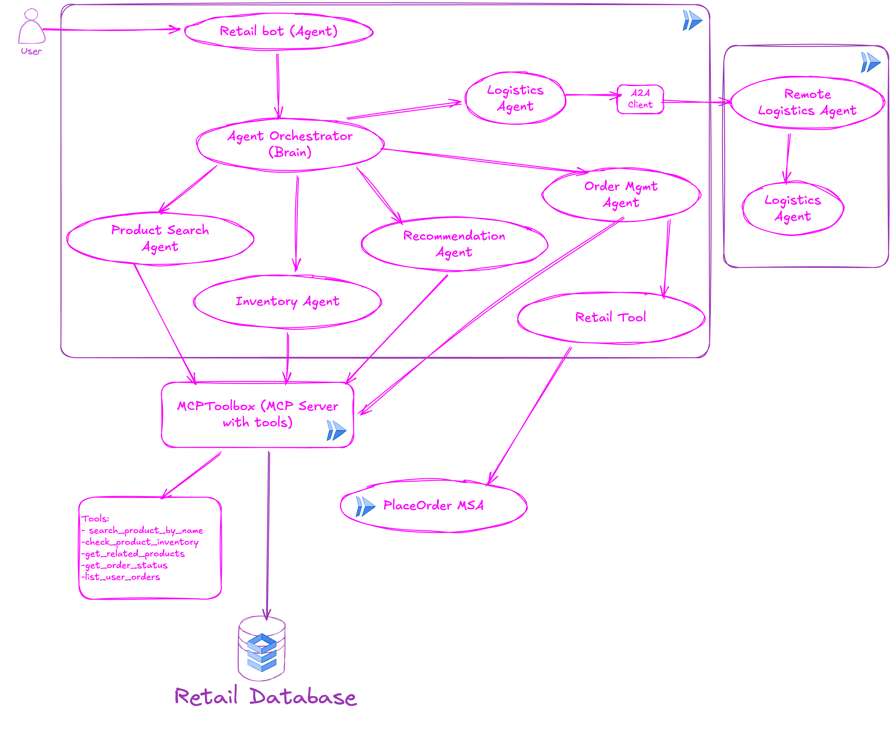
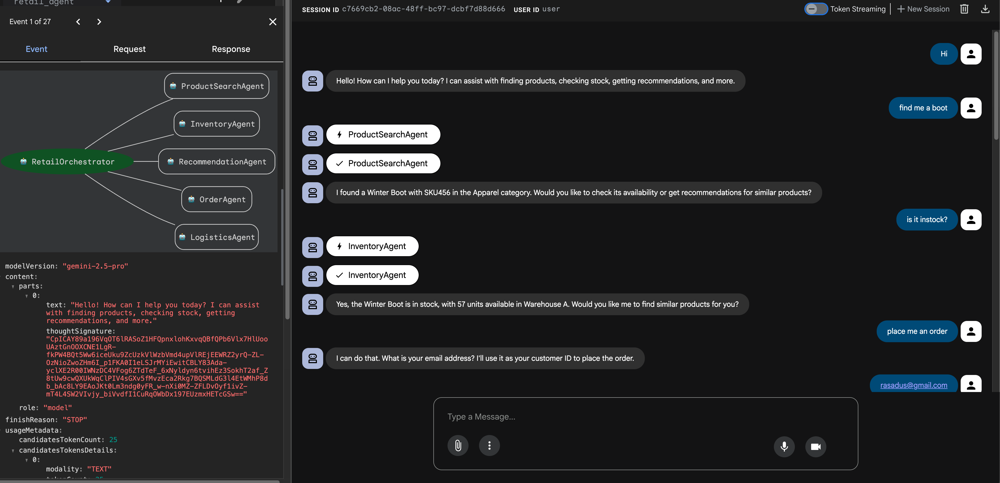
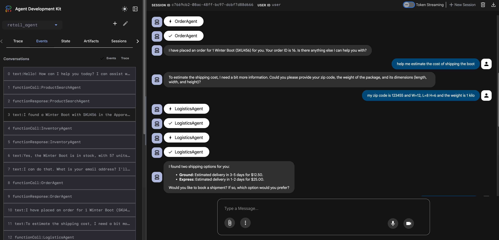
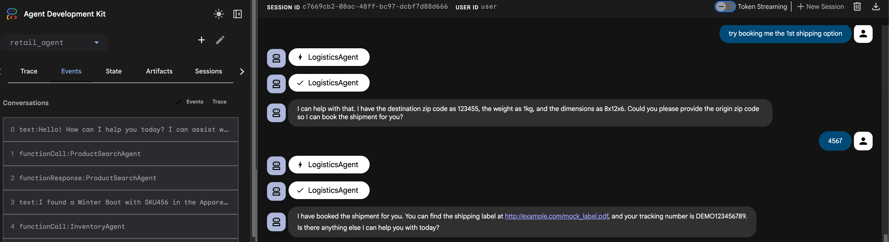

# Retail Agent

This project contains a Retail Agent built with the Google Agent Development Kit (ADK). The agent is designed to act as a retail assistant, capable of handling a variety of customer queries. It integrates with other services and agents to provide a comprehensive retail experience.

## Architecture

The Retail Agent is an orchestrator that leverages several specialist agents to handle specific tasks:

-   **ProductSearchAgent**: Searches for products in the retail database.
-   **InventoryAgent**: Checks for product inventory.
-   **RecommendationAgent**: Provides product recommendations.
-   **OrderAgent**: Handles order placement and status checks.
-   **LogisticsAgent**: Interacts with a remote logistics agent to handle shipment estimations, bookings, and tracking.

The agent uses a custom MCP (Multi-Controller Platform) Toolbox service for database access and communicates with a remote Logistics Agent via A2A (Agent-to-Agent) communication.

below is the highlevel Arch for:


## Prerequisites

Before you begin, ensure you have the following installed:

-   Python 3.11+
-   pip

## Setup

Follow these steps to set up your local development environment.

### 1. Clone the Repository

```bash
git clone https://github.com/Rasadus03/gcp-raniamoh.git
cd agentic-ai/retail-demo/retail_agent
```

### 2. Create and Activate a Python Virtual Environment

It's recommended to use a virtual environment to manage project dependencies.

```bash
python3 -m venv .venv
source .venv/bin/activate
```

### 3. Install Dependencies

The required Python packages are listed in `requirements.txt`.

```bash
pip install -r requirements.txt
```
### 4. Creation of the database:
The is the complete Database schema, you can run the [Retail Database](retail_db.sql) for tables and schema creation.


### 5. Setup Tools for MCPToolBox:
Update the [tools.yaml](tools.yaml) with the database connection in the source 

### 6. Set Project Environment Variables:

*   `GOOGLE_CLOUD_PROJECT`: GCP Project ID 
*   `GOOGLE_CLOUD_PROJECT_NUMBER`: GCP Project Number

 ```bash
    export GOOGLE_CLOUD_PROJECT="xxxxx"
    export GOOGLE_CLOUD_PROJECT_NUMBER="xxxxx"
```


### 7. Prep for the deployment of MCPToolbox:
```bash
    gcloud iam service-accounts create toolbox-identity

    gcloud projects add-iam-policy-binding $GOOGLE_CLOUD_PROJECT \
    --member serviceAccount:toolbox-identity@$GOOGLE_CLOUD_PROJECT.iam.gserviceaccount.com \
    --role roles/secretmanager.secretAccessor

    gcloud projects add-iam-policy-binding $GOOGLE_CLOUD_PROJECT \
    --member serviceAccount:toolbox-identity@$GOOGLE_CLOUD_PROJECT.iam.gserviceaccount.com \
    --role roles/cloudsql.client
    gcloud secrets create tools --data-file=tools.yaml

    export IMAGE=us-central1-docker.pkg.dev/database-toolbox/toolbox/toolbox:latest
```

**Important:** Everytime you change the tools.yaml, you need to update the secret by uploading a new version to it using the below command.
```bash
    gcloud secrets versions add tools --data-file=tools.yaml
```

### 8. Deploying the MCPToolbox to CloudRun:
```bash
    gcloud run deploy mcptoolbox     --image $IMAGE     --service-account toolbox-identity     --region europe-west4     --set-secrets "/app/tools.yaml=tools:latest"  --allow-unauthenticated   --args="--tools-file=/app/tools.yaml","--address=0.0.0.0","--port=8080","--ui" 
```
**Note:** We are deploying it using the --ui flag to enable the ui console.

### 9. Set Environment Variables

You'll need to export several environment variables. Create a `.env` file in the project root to manage them.

**Important:** Replace placeholder values with your actual service URLs.

```dotenv
# .env file

# URL for the MCP Toolbox service
MCP_TOOLBOX_URL="mcp_toolbox_cloud_run_url"

# URL for the remote Logistics Agent
LOGISTICS_AGENT_URL="logistics_agent_cloud_run_url"

# URL for the order placement Cloud Function
PLACE_ORDER_FUNCTION_URL="order_mgmt_svc_cloud_run_url"
```

### 10.Running the Agent locally:

You can run it locally using adk web

```bash
    adk web
```

### 11.Deploying Retail Agent to Cloud Run:

```bash
    adk deploy cloud_run \
    --project=${GOOGLE_CLOUD_PROJECT} \
    --region=europe-west4 \
    --service_name=retail-agent \
    --app_name=retail-agent \
    --with_ui \
    ./retail_agent
```
**Note:** We are deploying it using the --with_ui flag to enable adk web.

### 12.Test the deployed Agent:
    you can test it using the Retail Agent Cloud Run URL

### 13. Sample on how to test the Agent:



