# Autopilot Load-balancing between spot and regular workload

### There are multiple option for loadbalancing between spot and non spot workloads:
####1. Using Global Load balancer and multiple services:

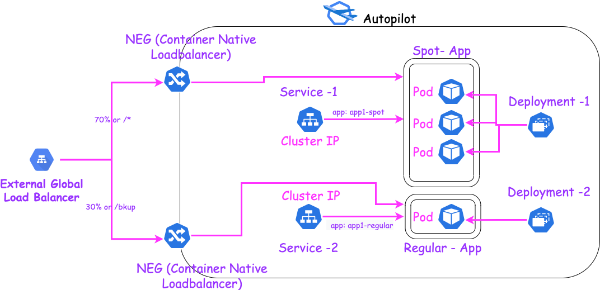


The solution offers 2 options:

A. Using a path ingress, using the below steps:
1. Please follow [Build Application Image][Build App] to build the application container and deploy the spot and non-Spot instances
2. Now deploy the 2 services as cluster IP with Container load balancer annotation to have the associated NEG got created:
 ```
        kubectl apply -f service-1.yaml
        kubectl apply -f service-2.yaml
 ```
3. Create an ingresss for 2 paths one for bkup and the other as the default
 ```
        kubectl apply -f ingress.yaml
 ```
4. Please wait for the ingress to be created and then you can use the public ip associated to the GLB to route to the app via ***[http://{LOAD_BALANCER_IP}/](http://{LOAD_BALANCER_IP}/)*** for the spot instances and ***[http://{LOAD_BALANCER_IP}/bkup](http://{LOAD_BALANCER_IP}/bkup)*** for the regular non spot instances

B. Using a path route weight, using the below steps:
1. Please follow [Build Application Image](/Build App) to build the application container and deploy the spot and non-Spot instances
2. Now deploy the 2 services as cluster IP with Container load balancer annotation to have the associated NEG got created:
 ```
        kubectl apply -f service-1.yaml
        kubectl apply -f service-2.yaml
 ```
3. Create a Load Balancer using the following :

   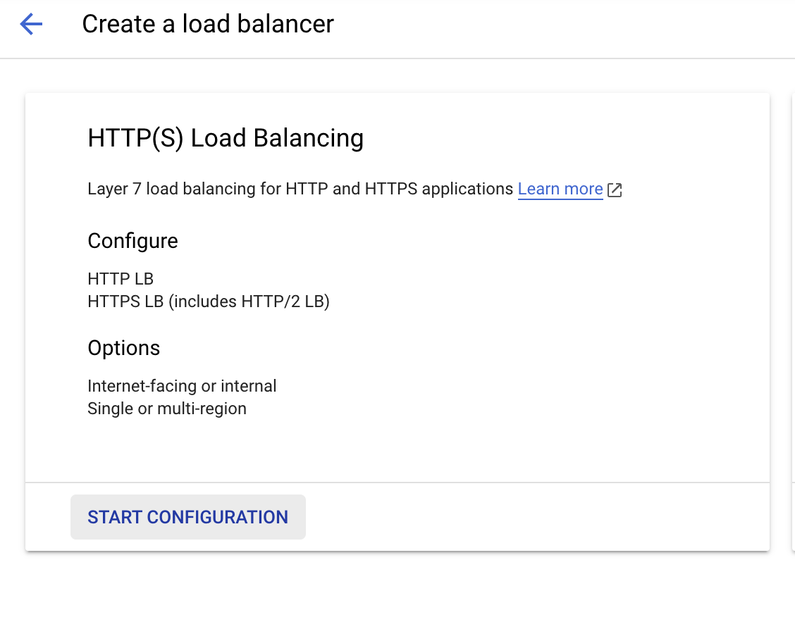
   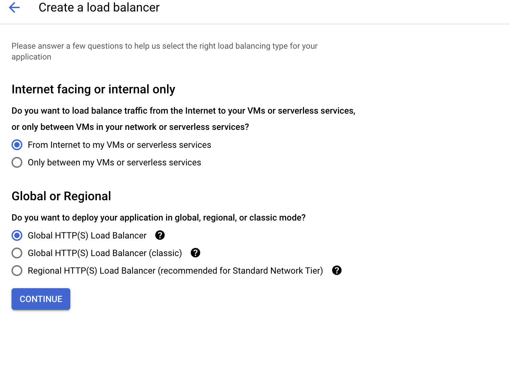
   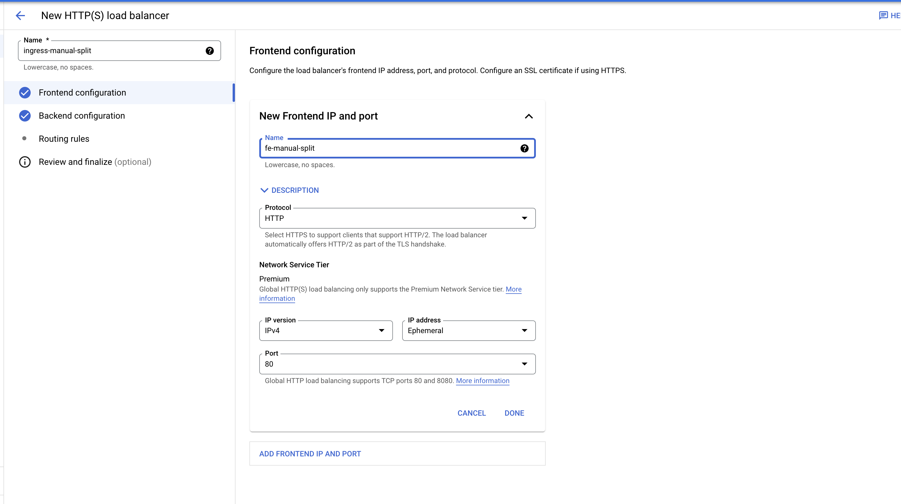
   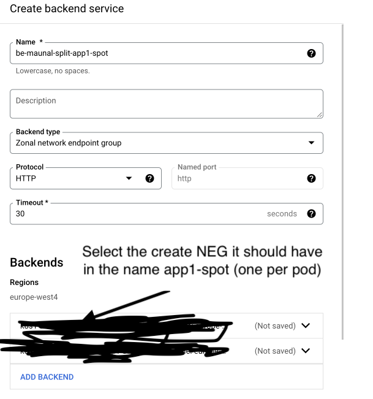
   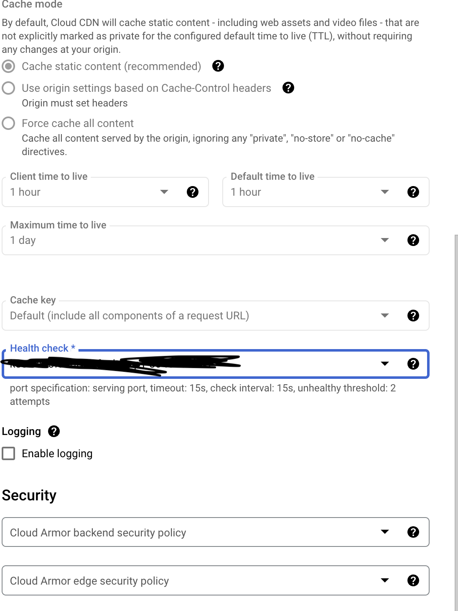
   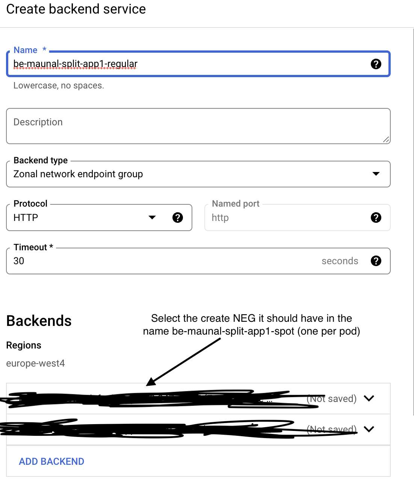
   
   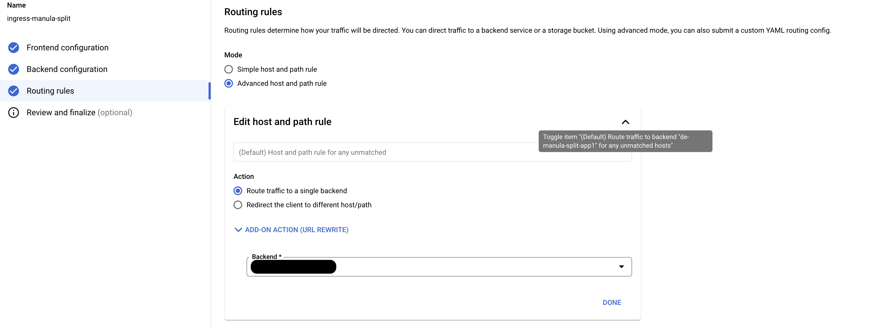
4. Click in the routing rules and add host and path rule and add Path matcher

```
        # Replace $GCLOUD_PROJECT with your project ID.
         defaultService: projects/$GCLOUD_PROJECT/global/backendServices/be-manual-split-app1-spot
         name: matcher1
         routeRules:
         - matchRules:
           - prefixMatch: /
           priority: 2
           routeAction:
             weightedBackendServices:
             - backendService: projects/$GCLOUD_PROJECT/global/backendServices/be-manual-split-app1-spot
               weight: 70
             - backendService: projects/$GCLOUD_PROJECT/global/backendServices/be-manual-split-app1-regular
               weight: 30
```
5. Please wait for the load balancer to be created and then you can use the public ip associated to the GLB to route to the app via ***[http://{LOAD_BALANCER_IP}/](http://{LOAD_BALANCER_IP}/)***  for checking the app.

####2. Using Global Load balancer and one single service and container native load balancer using the  below steps:

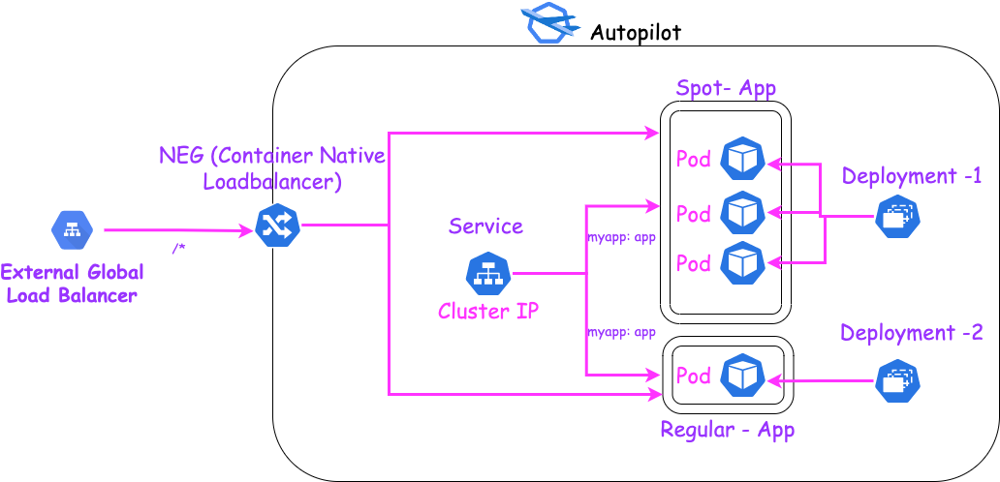

1. Please follow [Build Application Image][Build App] to build the application container and deploy the spot and non-Spot instances

2. Now deploy  a single service as cluster IP with Container load balancer annotation to have the associated NEG got created:
 ```
        kubectl apply -f service-cluster.yaml
 ```
3. Create an ingresss for the created neg as a default service
 ```
        kubectl apply -f ingress-cluster.yaml
 ```
4. Please wait for the ingress to be created and then you can use the public ip associated to the GLB to route to the app via ***[http://{LOAD_BALANCER_IP}/](http://{LOAD_BALANCER_IP}/)***

####3. Using  one loadbalancer single services using the  below steps:

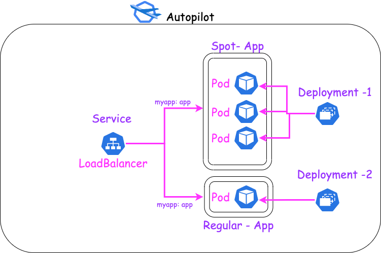

1. Please follow [Build Application Image][Build App] to build the application container and deploy the spot and non-Spot instances

2. Now deploy  a single service as a Load balancer service:
 ```
        kubectl apply -f service.yaml
 ```
4. Please wait for the service to be created and then you can use the public ip associated to the service to route to the app via ***[http://{LOAD_BALANCER_IP}/](http://{LOAD_BALANCER_IP}/)***
####4. Using Global Load balancer and one single node port services using the  below steps::

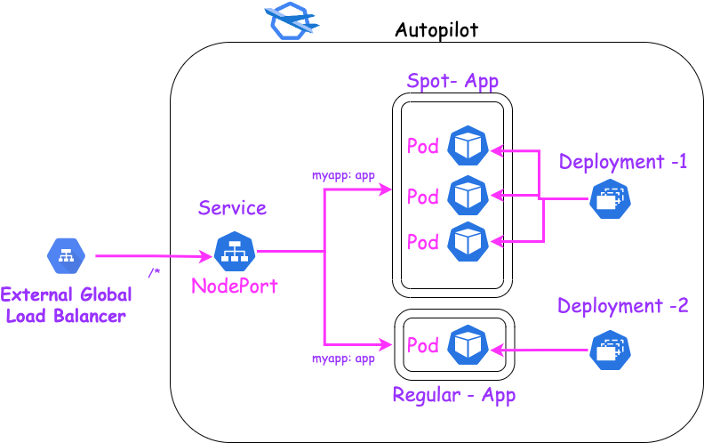

1. Please follow [Build Application Image][Build App] to build the application container and deploy the spot and non Spot instances

2. Now deploy  a single service as nodeport for loadbalancing between both app instances types:
 ```
        kubectl apply -f service-nodeport.yaml
 ```
3. Create an ingresss for the created service as a default service
 ```
        kubectl apply -f ingress-nodeport.yaml
 ```
4. Please wait for the ingress to be created and then you can use the public ip associated to the GLB to route to the app via ***[http://{LOAD_BALANCER_IP}/](http://{LOAD_BALANCER_IP}/)***

#### [Build App] Build and deploy Applications
1. Navigate to the  ***[App Folder](app)*** and run the below command:

```
     # Replace $LOCATION with your Artifact Registry location (e.g., us-west1).
     # Replace $GCLOUD_PROJECT with your project ID.
     # Replace $CONTAINER_REPO_NAME with your repository name hosting the built image.
     # Replace $IMAGE_NAME with the name of the built image.
       gcloud builds submit   --tag  $LOCATION-docker.pkg.dev/$GCLOUD_PROJECT/$CONTAINER_REPO_NAME/$IMAGE_NAME  .
```
2. Please update ***[deployment-1.yaml](deployment-1.yaml)***  and ***[deployment-2.yaml](deployment-2.yaml)***  for:
 ```
        # Replace $LOCATION with your Artifact Registry location (e.g., us-west1).
        # Replace $GCLOUD_PROJECT with your project ID.
        # Replace $CONTAINER_REPO_NAME with your repository name hosting the built image.
        # Replace $IMAGE_NAME with the name of the built image.
        image: $LOCATION-docker.pkg.dev/$GCLOUD_PROJECT/$CONTAINER_REPO_NAME/$IMAGE_NAME:latest
  ```
3. Please deploy both deployments by running the following command:
 ```
        kubectl apply -f deployment-1.yaml
        kubectl apply -f deployment-2.yaml
  ```