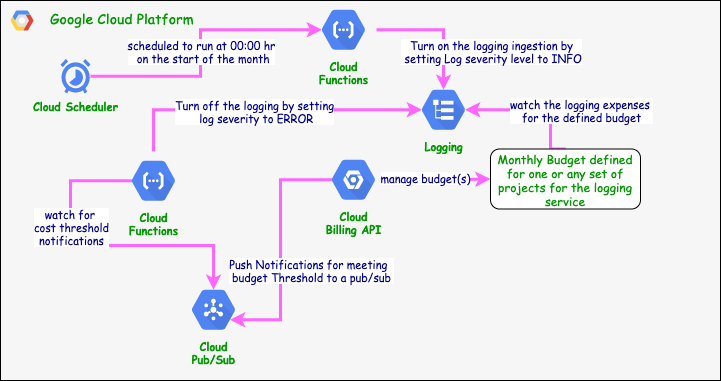
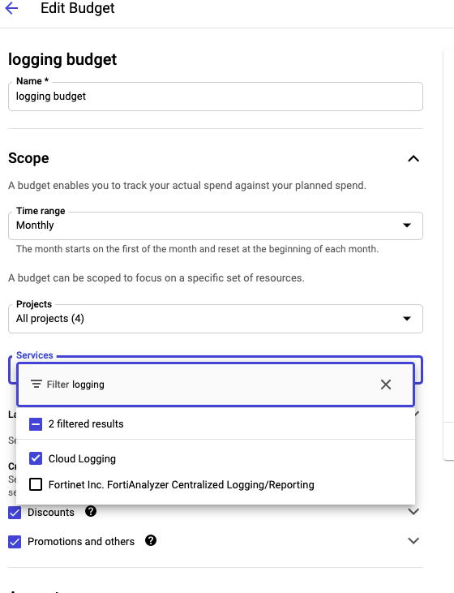
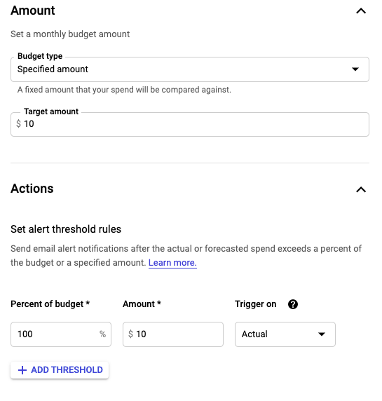
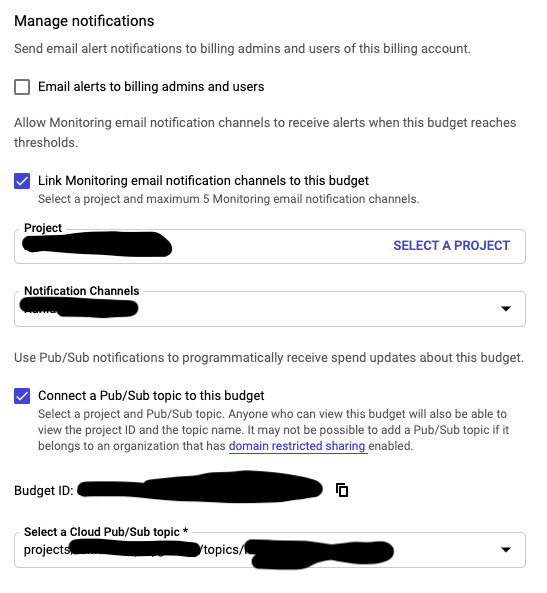

## This is a Solution to control the Cost of the logging for a workspace or a project in GCP Stackdriver 
### It is based on  ***[Examples of automated cost control responses](https://cloud.google.com/billing/docs/how-to/notify#test-your-cloud-function)***
#### The solution consists of the components shown in the following diagram:

Here are the guidelines for implementing the solution in your GCP environment:

1. Navigate to the billing account the create a Budget for the logging service on one or more Project. Set the budget:
    - a) Target ammount
    - b) Threshold
    - c) Notifications -- connect notification to a pub/sub topic.

Use the below screnshots for guidance

2. Navigate to I&AM and create 2 SAs:
    - a) logmanager with Log Admin role
    - b) cf-invoker with Cloud Functions Invoker role
3. Navigate to Cloud Function and create 2 functions from the above cf code (log_cost_control & reset-logging-filters):
    - a) Setup log_cost_control with the following configurations:
        - i)   To be Triggered from the budget threshold ntofication topic, created in step 1.c
        - ii)  To use logmanage SA as a runtime service account
        - iii) To use Python 3.9 as a runtime  
    - b) Setup  reset-logging-filters with the following configurations:
        - i)   To be Triggered from an https endpoint
        - ii)  To use logmanage SA as a runtime service account
        - iii) To use Python 3.9 as a runtime
        - iv)  To add cf-invoker as a principle if not automatically added by I&AM
4. Navigate to the cloud scheduler and create a new job with the following configurations:
    - a) To run on 00:00 hr on the 1st day of a calendar mont by conffiguring the Frequency as 0 0 1 * *
    - b) Set the Target to HTTP and the url to the reset-logging-filters Http trigger url.
    - c) set auth header to add oidc token passing the sa name as cf-invoker created accoun in step 2.b.

