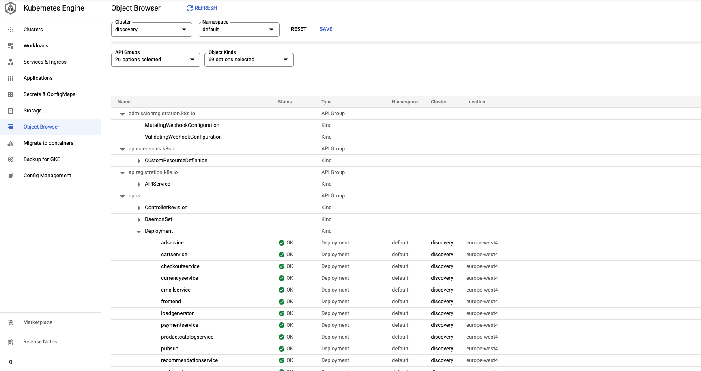

##  This is a Solution to discover the running workloads and understand its topology for GKE clusters that are not running any services mesh soln or ASM:

### The First alternative is via infranode visibility: 

Here are the guidelines for implementing the solution:

1. Enable the infranode visibility following this guide  ***[Enable intranode visibility on an existing cluster](https://cloud.google.com/kubernetes-engine/docs/how-to/intranode-visibility#enable_intranode_visibility_on_an_existing_cluster)***:
    - a) Validate that the GKE cluster is greater than GKE 1.15, if not please upgrade the nodes
    - b) Enable the VPC flow on the subnet used by the GKE cluster, make the Sample rate at 100% 
    - c) Enable cluster logging and monitoring (especially for workload).

2. Navigate to Cloud Logging and create a sync with to include the vpc flow logs :
    - a) Create a log sink to BQ with inclusion filter = logName:("projects/**PROJECT_ID**/logs/compute.googleapis.com%2Fvpc_flows"). You may choose to add there a filter on the cluster name via jsonPayload.src_gke_details.cluster.cluster_name or jsonPayload.dest_gke_details.cluster.cluster_name
    - b) Make sure to map the sync to a table name in a multi regional dataset in BigQuery.
   
3. Navigate to Big query to discover the dependencies from the following queries:
    - a) Query pod to pod communication ***[vpc-flow-bq-flow-query.sql](bq-resources/vpc-flow-bq-flow-query.sql)***
    - b) Identify the public service communication via inquiring their ips  ***[vpc-flow-bq-public-ip-service-query.sql](bq-resources/vpc-flow-bq-public-ip-service-query.sql)***

#####  The Second alternative is via DataPlane V2 network logging policy: 

Here are the guidelines for implementing the solution:

1. Enable the Network policy logging following this guide  ***[Configuring network policy logging](https://cloud.google.com/kubernetes-engine/docs/how-to/network-policy-logging)***:
   - a) Validate that DataPlane V2 is enabled on the GKE cluster 
   - b) Enable log but setting the log to true in your cluster, the log should look as ***[default-networklogging.yaml](k8s-resources/default-networklogging.yaml)***
   - c) Enable cluster logging and monitoring (especially for workload).
   - d) Enable allow all ingress network policy with a turned on logging flag using the ***[allow-all-ingress-net-policy.yaml](k8s-resources/allow-all-ingress-net-policy.yaml)*** 
   - e) Enable allow all egress network policy with a turned on logging flag using the ***[allow-all-egress-net-policy.yaml](k8s-resources/allow-all-egress-net-policy.yaml)***

2. Navigate to Cloud Logging and create a sync with to include the vpc flow logs :
   - a) Create a log sink to BQ with inclusion filter = resource.type="k8s_node"
     log_name="projects/**PROJECT_ID**/logs/policy-action". You may choose to add there a filter on the cluster name and/or location via resource.labels.location or/ and resource.labels.cluster_name
   - b) Make sure to map the sync to a table name in a multi regional dataset in BigQuery.

3. Navigate to Big query to discover the dependencies from the following queries:
   - a) Query app communication flow ***[net-policy-actions-bq-queries.sql](bq-resources/net-policy-actions-bq-queries.sql)***

#####  The third alternative is via Object Browser in K8s console, please check the below screenshot for guidance 

