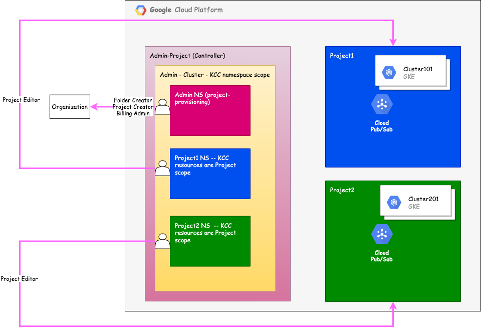

### This is a Solution to implement Multi-tenant using KCC
#### The solution consists of the components shown in the following diagram:


Here are the guidelines for implementing the solution in your GCP environment:

**Note: Please replace Hosting_Project_ID  with the Project id hosting the KCC Admin cluster in all commands**

1. Setup a GKE cluster and make sure Workload identity and monitoring are enabled following the guidelines in ***[Preprequisite](https://cloud.google.com/config-connector/docs/how-to/advanced-install#before_you_begin)***
_________________ 
**Install KCC Manually using K8Operator**

2. Manually install the KCC Operator:
   ```
    gsutil cp gs://configconnector-operator/latest/release-bundle.tar.gz release-bundle.tar.gz
    tar zxvf release-bundle.tar.gz
    kubectl apply -f operator-system/configconnector-operator.yaml
    ```
3. Setup KCC to run in a namescoped mode by running ***[kcc.yaml](kcc.yaml)***
    ```
    kubectl apply -f kcc.yaml
   ```
_________________
**Provision Admin Tenant**
4. Create an admin NS call it "admin-kcc" for provisioning Projects and folders
   ```
    kubectl create namespace admin-kcc
    ```
5. Create a GSA in the Project hosting the KCC Cluster for the admin activities, provisioning projects, creating Folders and assigning billing ids to the projects
    ```
    gcloud iam service-accounts create admin-krm-gsa --project Hosting_Project_ID
    ```
6. Assign Project creator, Folder Creator and Billing Admin to KCC Admin GSA
    ```
    gcloud organizations  add-iam-policy-binding  ORG_ID  --member="serviceAccount:admin-krm-gsa@Hosting_Project_ID.iam.gserviceaccount.com"  --role='roles/resourcemanager.projectCreator'
    gcloud organizations  add-iam-policy-binding  ORG_ID  --member="serviceAccount:admin-krm-gsa@Hosting_Project_ID.iam.gserviceaccount.com"  --role='roles/resourcemanager.folderCreator' 
    gcloud organizations  add-iam-policy-binding  ORG_ID  --member="serviceAccount:admin-krm-gsa@Hosting_Project_ID.iam.gserviceaccount.com"  --role='roles/billing.admin'
    ```
7. Grant WorkloadIdentity access to KCC Admin GSA 
    ```
    gcloud iam service-accounts add-iam-policy-binding admin-krm-gsa@Hosting_Project_ID.iam.gserviceaccount.com     --member="serviceAccount:Hosting_Project_ID.svc.id.goog[cnrm-system/cnrm-controller-manager-admin-kcc]"     --role="roles/iam.workloadIdentityUser"     --project Hosting_Project_ID
    ```
8. Grant KCC Admin GSA mertic write access
    ```
    gcloud projects add-iam-policy-binding Hosting_Project_ID     --member="serviceAccount:admin-krm-gsa@Hosting_Project_ID.iam.gserviceaccount.com"     --role="roles/monitoring.metricWriter"
    ```
9. Enable KCC Admin tenant in the admin-kcc namespace by applying ***[kcc-admin.yaml](admin/kcc-admin.yaml)***

10. Validate the setup of the kcc tenant 
    ```
    kubectl get serviceaccount/cnrm-controller-manager-admin-kcc  -n cnrm-system
    kubectl wait -n cnrm-system \
       --for=condition=Ready pod \
       -l cnrm.cloud.google.com/component=cnrm-controller-manager \
       -l cnrm.cloud.google.com/scoped-namespace=admin-kcc
    ```
11. Create a folder by applying ***[org-krm-folder-krm.yaml](admin/org-krm-folder-krm.yaml)***

12. Create the first project by applying ***[org-krm-folder-krm-project1](admin/org-krm-folder-krm-project1)***

13. Create the second project by applying ***[org-krm-folder-krm-project2](admin/org-krm-folder-krm-project2)***

_________________
**Provision Project-1 Tenant**
14. Create a project-1 NS call it "project-1" for provisioning Projects and folders
    ```
    kubectl create namespace project-1
    ```
15. Create a GSA, Project 1 KCC GSA, in the Project hosting the KCC Cluster for the project-1's resources provisioning activities, for simplicity owner role is assigned
    ```
    gcloud iam service-accounts create project1-krm-gsa --project Hosting_Project_ID
    ```
16. Assign Project Owner to Project 1 KCC GSA
    ```
    gcloud projects add-iam-policy-binding ricky-krm-project1 \
    --member="serviceAccount:project1-krm-gsa@Hosting_Project_ID.iam.gserviceaccount.com" \
    --role="roles/owner"
    ```
17. Grant WorkloadIdentity access to Project 1 KCC GSA
    ```
    gcloud iam service-accounts add-iam-policy-binding project1-krm-gsa@Hosting_Project_ID.iam.gserviceaccount.com     --member="serviceAccount:Hosting_Project_ID.svc.id.goog[cnrm-system/cnrm-controller-manager-project-1]"     --role="roles/iam.workloadIdentityUser"     --project Hosting_Project_ID
    ```
18. Grant KCC Admin GSA mertic write access
    ```
    gcloud projects add-iam-policy-binding Hosting_Project_ID     --member="serviceAccount:project1-krm-gsa@Hosting_Project_ID.iam.gserviceaccount.com"     --role="roles/monitoring.metricWriter"
    ```
19. Enable Project 1 KCC  tenant in the project-1 namespace by applying ***[project1-kcc.yaml](project-1/project1-kcc.yaml)***

20. Validate the setup of the kcc tenant
    ```
    kubectl get serviceaccount/cnrm-controller-manager-project-1  -n cnrm-system
    kubectl wait -n cnrm-system \
    --for=condition=Ready pod \
    -l cnrm.cloud.google.com/component=cnrm-controller-manager \
    -l cnrm.cloud.google.com/scoped-namespace=project-1
    ```
21. Create the network in project 1 project by applying ***[project1-krm-vpc-net2.yaml](project-1/project1-krm-vpc-net2.yaml)***

22. Create the network subnet in project 1 project by applying ***[project1-krm-vpc-subnet-net2.yaml](project-1/project1-krm-vpc-subnet-net2.yaml)***

23. Create the krm-echo-topic-1 pubsub and cluster1-krm-notifications pubsub in project 1 project by applying ***[project1-krm-pubsub-echopubsub.yaml](project-1/project1-krm-pubsub-echopubsub.yaml)***  and ***[project1-krm-pubsub-topic1.yaml](project-1/project1-krm-pubsub-topic1.yaml)***

24. Create GKE Cluster in project 1 project by applying ***[project1-krm-gke-cluster-cluster1.yaml](project-1/project1-krm-gke-cluster-cluster1.yaml)***

_________________
**Provision Project-2 Tenant**
25. Create a project-2 NS call it "project-2" for provisioning Projects and folders
    ```
    kubectl create namespace project-2
    ```
26. Create a GSA, Project 2 KCC GSA, in the Project hosting the KCC Cluster for the project-2's resources provisioning activities, for simplicity owner role is assigned
    ```
    gcloud iam service-accounts create project2-krm-gsa --project Hosting_Project_ID
    ```
27. Assign Project Owner to Project 2 KCC GSA
    ```
    gcloud projects add-iam-policy-binding ricky-krm-project1 \
    --member="serviceAccount:project2-krm-gsa@Hosting_Project_ID.iam.gserviceaccount.com" \
    --role="roles/owner"
    ```
28. Grant WorkloadIdentity access to Project 2 KCC GSA
    ```
    gcloud iam service-accounts add-iam-policy-binding project2-krm-gsa@Hosting_Project_ID.iam.gserviceaccount.com     --member="serviceAccount:Hosting_Project_ID.svc.id.goog[cnrm-system/cnrm-controller-manager-project-2]"     --role="roles/iam.workloadIdentityUser"     --project Hosting_Project_ID
    ```
29. Grant KCC Admin GSA mertic write access
    ```
    gcloud projects add-iam-policy-binding Hosting_Project_ID     --member="serviceAccount:project2-krm-gsa@Hosting_Project_ID.iam.gserviceaccount.com"     --role="roles/monitoring.metricWriter"
    ```
30. Enable Project 2 KCC  tenant in the project-2 namespace by applying ***[project2-kcc.yaml](project-2/project2-kcc.yaml)***

31. Validate the setup of the kcc tenant
    ```
    kubectl get serviceaccount/cnrm-controller-manager-project-2  -n cnrm-system
    kubectl wait -n cnrm-system \
    --for=condition=Ready pod \
    -l cnrm.cloud.google.com/component=cnrm-controller-manager \
    -l cnrm.cloud.google.com/scoped-namespace=project-2
    ```
32. Create the network in project 2 project by applying ***[project2-krm-vpc-net2.yaml](project-2/project2-krm-vpc-net2.yaml)***

33. Create the network subnet in project 2 project by applying ***[project2-krm-vpc-subnet-net2.yaml](project-2/project2-krm-vpc-subnet-net2.yaml)***

34. Create the krm-echo-topic-1 pubsub and cluster1-krm-notifications pubsub in project 2 project by applying ***[project2-krm-pubsub-echopubsub.yaml](project-2/project2-krm-pubsub-echopubsub.yaml)***  and ***[project2-krm-pubsub-topic1.yaml](project-2/project2-krm-pubsub-topic1.yaml)***

35. Create GKE Cluster in project 2 project by applying ***[project2-krm-gke-cluster-cluster1.yaml](project-2/project2-krm-gke-cluster-cluster1.yaml)***
