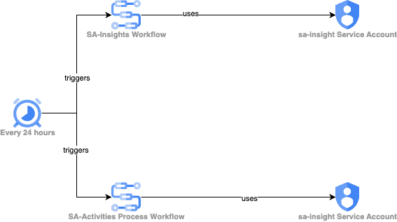

### This is a Solution to audit service accounts activites and log it in the process for being fixed by an external soc
#### The solution consists of the components shown in the following diagram:


Here are the guidelines for implementing the solution in your GCP environment:

**Note: Please replace Project_ID with your project id and ORG_ID with organization id**

1. The first workflow "sa-insight", loop on all the projects and inquire all the insights for all projects and create log notification. Create the "sa-insights" workflow using the following steps:
- Create workflow service account:
```
    gcloud iam service-accounts create  sa-insights
```
- Grant accesses to the workflow sa:
```
    #Grant the SA access to inquire all security insights and Project listing on the Organization level
    #replace ORG_ID with the Organization id
    gcloud organizations add-iam-policy-binding ORG_ID \
    --member "serviceAccount:sa-insights@PROJECT_ID.iam.gserviceaccount.com" \
    --role "roles/servicesecurityinsights.securityInsightsViewer"
    
    gcloud organizations add-iam-policy-binding ORG_ID \
    --member "serviceAccount:sa-insights@PROJECT_ID.iam.gserviceaccount.com" \
    --role "roles/resourcemanager.projectIamAdmin"
```
- Replace the ORG_ID in ***[sa-insight-workflow.yaml](sa-insight-workflow.yaml)***  with the organization ID. 
- Create the workflow sa-insights:
```
   #replace LOCATION_NAME with the region name (e.g. europe-west4)
   gcloud workflows deploy sa-insights --source=sa-insight-workflow.yaml \
    --service-account=sa-insights@PROJECT_ID.iam.gserviceaccount.com --location=LOCATION_NAME
```
- Create an SA that can invoke the workflow:
```
    gcloud iam service-accounts create  workflow-invoker
```

- Grant accesses to the workflow invoker sa:
```
    #replace PROJECT_ID with the project id
    gcloud projects add-iam-policy-binding PROJECT_ID \
    --member "serviceAccount:workflow-invoker@PROJECT_ID.iam.gserviceaccount.com" \
    --role "roles/workflows.invoker"
 
```

- Create a schedule to run the workflow at 00:00 every day:
```
    #replace PROJECT_ID with the project id
    #replace LOCATION_NAME with the region name (e.g. europe-west4)
    #replace TIMEZONE_ID with the proper country timezone (e.g. Europe/Amsterdam)
    gcloud scheduler jobs create http run-sa-insights \
        --schedule="* 0 * * *" \
        --uri="https://workflowexecutions.googleapis.com/v1/projects/PROJECT_ID/locations/LOCATION_NAME/workflows/sa-insights/executions" \
        --time-zone= TIMEZONE_ID \
        --oauth-service-account-email="workflow-invoke@PROJECT_ID.iam.gserviceaccount.com"
```
2. The second workflow "sa-activities", loop on all the projects, enable the policyanalyzer API and inquire all SAs activities for all projects and create log notification for all SA that has been inactive for 30 days or more. Create the "sa-audit" workflow using the following steps:
- Create workflow service account:
```
    gcloud iam service-accounts create  sa-audit
```
- Grant accesses to the workflow sa:
```
    #Grant the SA access to enable APIs, inquire all activities  and Project listing on the Organization level
    #replace ORG_ID with the Organization id
    gcloud organizations add-iam-policy-binding ORG_ID \
    --member "serviceAccount:sa-audit@PROJECT_ID.iam.gserviceaccount.com" \
    --role "roles/serviceusage.serviceUsageAdmin"
    
    #replace ORG_ID with the Organization id
    gcloud organizations add-iam-policy-binding ORG_ID \
    --member "serviceAccount:sa-audit@PROJECT_ID.iam.gserviceaccount.com" \
    --role "roles/policyanalyzer.activityAnalysisViewer"
    
    gcloud organizations add-iam-policy-binding ORG_ID \
    --member "serviceAccount:sa-audit@PROJECT_ID.iam.gserviceaccount.com" \
    --role "roles/resourcemanager.projectIamAdmin"
```
- Replace the ORG_ID in ***[sa-audit-workflow.yaml](sa-audit-workflow.yaml)***  with the organization ID. Also you may configure and change the 30 days set in the inactiveDays parameter. 
- Create the workflow sa-insights:
```
   #replace LOCATION_NAME with the region name (e.g. europe-west4)
   gcloud workflows deploy sa-audit --source=sa-audit-workflow.yaml \
    --service-account=sa-audit@PROJECT_ID.iam.gserviceaccount.com --location=LOCATION_NAME
```
- Create an SA that can invoke the workflow or leverage the existing sa created in step 1:
```
    gcloud iam service-accounts create  workflow-invoker
```

- Grant accesses to the workflow invoker sa:
```
    #replace PROJECT_ID with the project id
    gcloud projects add-iam-policy-binding PROJECT_ID \
    --member "serviceAccount:workflow-invoker@PROJECT_ID.iam.gserviceaccount.com" \
    --role "roles/workflows.invoker"
 
```

- Create a schedule to run the workflow at 00:00 every day:
```
    #replace PROJECT_ID with the project id
    #replace LOCATION_NAME with the region name (e.g. europe-west4)
    #replace TIMEZONE_ID with the proper country timezone (e.g. Europe/Amsterdam)
    gcloud scheduler jobs create http run-sa-audit \
        --schedule="* 0 * * *" \
        --uri="https://workflowexecutions.googleapis.com/v1/projects/PROJECT_ID/locations/LOCATION_NAME/workflows/sa-audit/executions" \
        --time-zone= TIMEZONE_ID \
        --oauth-service-account-email="workflow-invoke@PROJECT_ID.iam.gserviceaccount.com"
```
