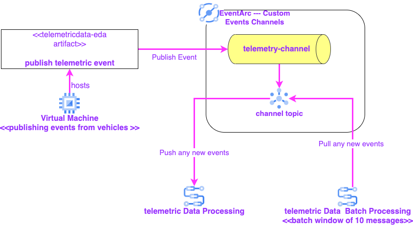

### This is a Solution to implement  processing of the Telemetry data  using event arc
#### The solution consists of the components shown in the following diagram:

Here are the guidelines for implementing the solution in your GCP environment:

**Note: Please replace Project_ID**

1. Create EventArc custom channel  by running the following commands:
   - Enable all required APIs:
``` gcloud services enable  \
    eventarc.googleapis.com \
    eventarcpublishing.googleapis.com \
    workflows.googleapis.com
   ```
- Create the telemetry-channel custom event channel
```
    cloud eventarc channels create 
```
2. Create workflow "telemetric-data-processing" using the following command:
- Create workflow service account:
```
    gcloud iam service-accounts create  workflow-sa
```
- Grant access to the workflow sa:
```
    #replace PROJECT_ID with the project id
    gcloud projects add-iam-policy-binding PROJECT_ID \
    --member "serviceAccount:workflow-sa@PROJECT_ID.iam.gserviceaccount.com" \
    --role "roles/logging.logWriter"
    
    gcloud projects add-iam-policy-binding PROJECT_ID \
    --member "serviceAccount:workflow-sa@PROJECT_ID.iam.gserviceaccount.com" \
    --role "roles/pubsub.subscriber"
```
- Create the workflow telemetric-data-processing:
```
   gcloud workflows deploy telemetric-data-processing --source=telemetric-data-processing.yaml \
    --service-account=workflow-sa@PROJECT_ID.iam.gserviceaccount.com
```
3. Update the batch-processing-telemetricdata with the eventarc 
4. Create the "batch-processing-telemetricdata" workflow which log every 10 messages:
- Create the worklow:
```
   gcloud workflows deploy batck-processing-telemetricdata --source=batck-processing-telemetricdata.yaml \
    --service-account=workflow-sa@PROJECT_ID.iam.gserviceaccount.com
```
4. Create a new VM named "telemetry-edge" as e2 standard-2 with the  ***[vm-startup.sh](vm-startup.sh)*** as the startup script
5. SSH into the VM then run clone the repo by running the follow script
```
   # Clone the source repository.
   git clone https://github.com/Rasadus03/gcp-raniamoh.git
```
7. cd into the telemetricdata-eda
8. build the client by running the following command
```
   mvn clean install
```
9. Create SA used by the client and generate the SA secret (JSON File) and setup the Google app credentials pointing to the JSON file using the following commands"
```
   #replace PROJECT_ID with the project id
   gcloud iam service-accounts create telemetrics-sa
   gcloud projects add-iam-policy-binding PROJECT_ID \
    --member "serviceAccount:telemetric-sa@PROJECT_ID.iam.gserviceaccount.com" \
    --role "roles/eventarc.publisher"
   gcloud iam service-accounts keys create telemetric-sa.json  \
       --iam-account=telemetrics-sa@PROJECT_ID.iam.gserviceaccount.com
   EXPORT GOOGLE_APPLICATION_CREDENTIALS='PATH_TO_THE_JSON_SECRET_FILE'
```
10. Run the publish by running the following command
```
   mvn compile exec:java -Dexec.mainClass="com.baeldung.main.Exec"
```
11. Now publish 10 messages and check both workflows to see the logged concatinated messages for the 10 batched messages 
